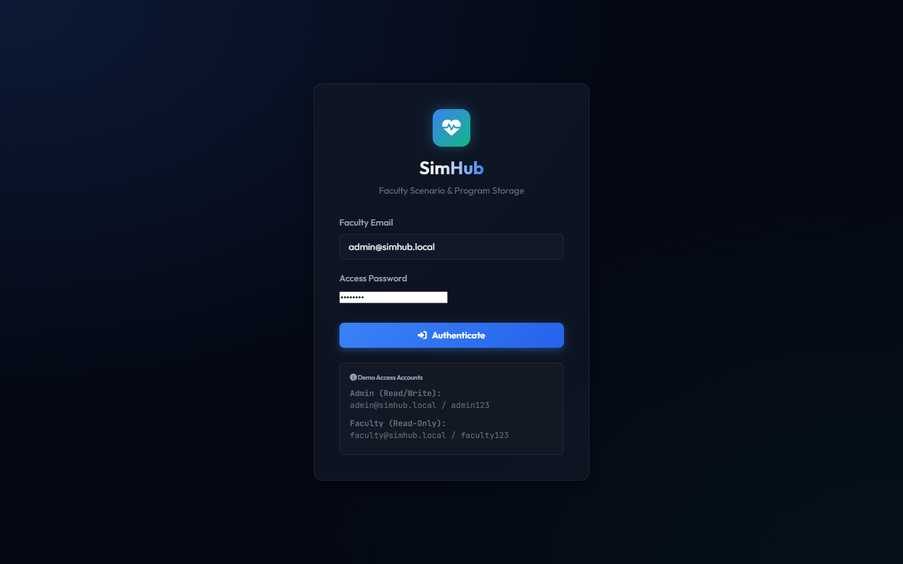
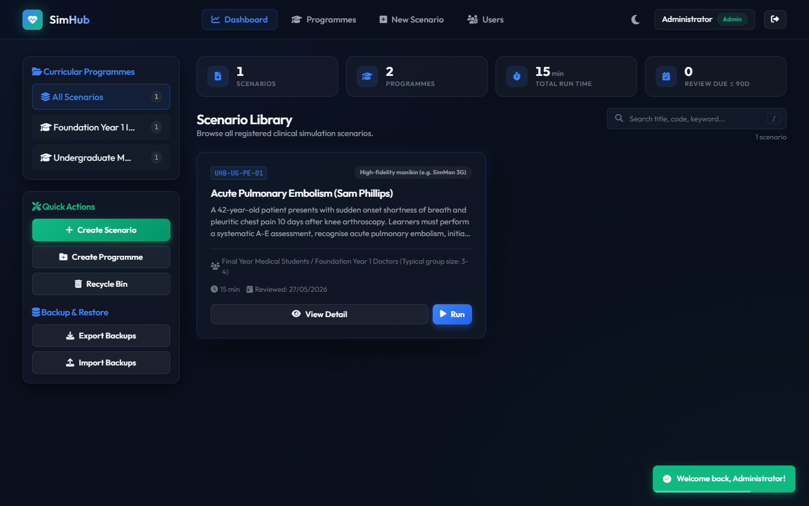
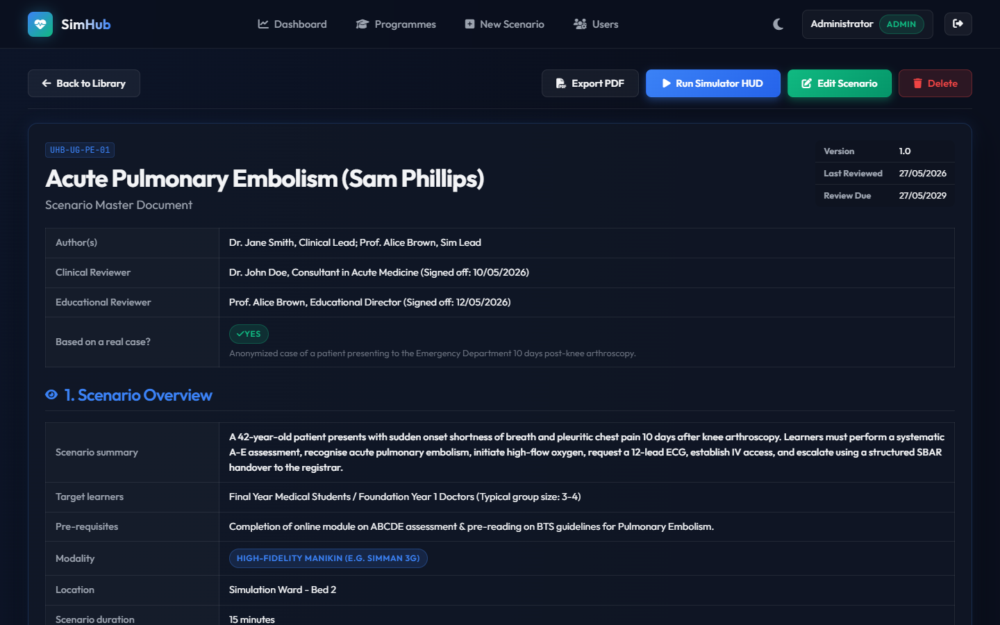
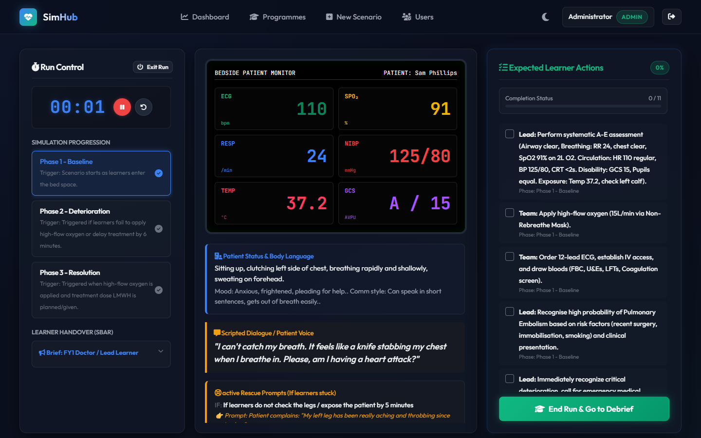
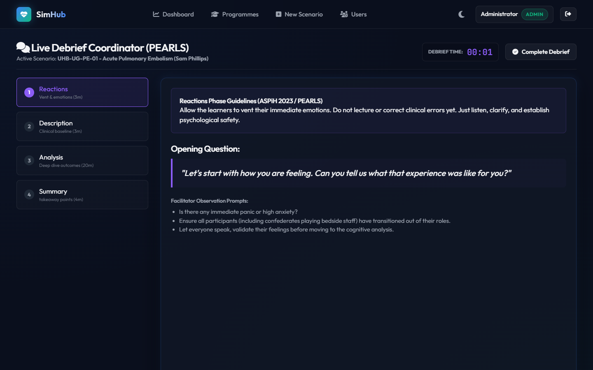
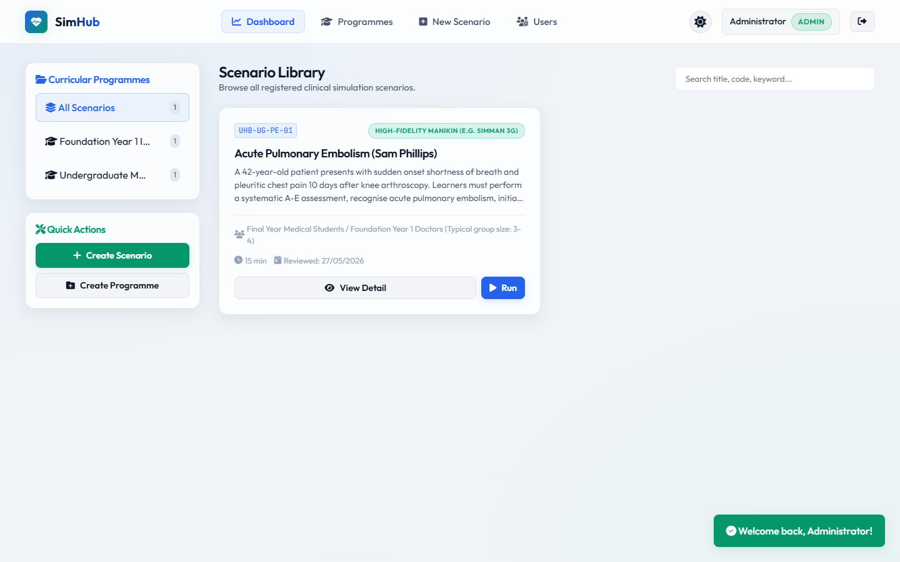

# SimHub 🩺

[](https://opensource.org/licenses/MIT)
[](https://nodejs.org/)
[]()

**SimHub is a free, open-source scenario management and run-time system for clinical simulation teams.** Write your scenarios once in a structured, ASPiH-aligned format, organise them into course programmes, run them live with an on-screen patient monitor, and debrief with a built-in PEARLS guide — all from one web app that runs entirely on your own hardware.

It is built for simulation centres, clinical skills departments, and education teams who want the structure of a commercial simulation platform without the licence fees, per-seat pricing, or handing their scenario library to a third-party cloud.

---

## 💷 Why a free, open-source platform?

If you are currently managing scenarios in Word documents and shared drives — or paying for a commercial platform — here is what SimHub offers:

| | SimHub | Typical paid platform | Word docs + shared drive |
| :--- | :--- | :--- | :--- |
| **Cost** | £0, forever (MIT licence) | Annual licence, often per-seat | "Free", but unstructured |
| **Your data** | Stays on your own machine/server | Vendor's cloud | Scattered, versioning by filename |
| **Users & scenarios** | Unlimited | Often tiered | Unlimited |
| **Structure & governance** | Enforced ASPiH-aligned template, version history, review dates | Varies | Manual, inconsistent |
| **Run-time support** | Live vitals HUD, phase progression, timers, cue prompts | Usually yes | Printed sheets |
| **If the vendor disappears** | Nothing changes — you have the code and the data | Migration project | — |

Because your entire scenario library lives in plain, human-readable JSON files on your own hardware, there is **no vendor lock-in and nothing leaves your building** — which also makes conversations with your information governance team considerably shorter.

### What SimHub is *not* (yet)

Honesty helps you evaluate. SimHub does not currently do: manikin/hardware control, audiovisual capture or video-assisted debriefing, learner-facing accounts or assessment scoring, or LMS integration. It manages, runs, and debriefs your *scenarios* — it does not replace your AV system or your manikin software.

---

## 🌟 What can it do?

**📝 Plan & write** — A guided seven-step scenario builder covering everything the [ASPiH](https://aspih.org.uk/) standards expect: governance and sign-off, learning outcomes (technical and non-technical), patient demographics and clinical background, SBAR handovers, faculty and simulated-participant roles with scripts, equipment and medication checklists, environment setup, and multi-phase clinical progression with target vitals.

**🗂️ Organise** — Group scenarios into curriculum programmes (e.g. *Year 5 Undergraduate Medicine*, *FY1 Induction*), search the whole library instantly, and track review-due dates so nothing quietly goes out of date.

**▶️ Run** — A real-time facilitator HUD with a simulated bedside monitor (live ECG trace paced by the scripted heart rate), phase-by-phase progression that updates target vitals at a click, a run timer, expected-action checklists, rescue-cue prompts, and confederate scripts to hand.

**🗣️ Debrief** — A built-in guide based on the [PEARLS](https://debrief2learn.org/pearls-debriefing-tool/) framework, pre-filled with the questions and analysis points you wrote into the scenario, with its own timer for each debrief phase.

**🔐 Govern** — Role-based access (Admin / programme-scoped Editor / Read-Only), full user administration with bulk operations, forced password rotation for provisioned accounts, scenario version history, a recycle bin for accidental deletions, one-click JSON backup and restore, and PDF export of any scenario for printing or sharing.

---

## 📸 SimHub in action

| 🔐 Login Gateway | 📊 Faculty Dashboard |
| :---: | :---: |
|  |  |

| 🩺 Scenario Details | 💻 Interactive Run HUD |
| :---: | :---: |
|  |  |

| 🗣️ PEARLS Debrief Guide | ☀️ High-Contrast Light Mode |
| :---: | :---: |
|  |  |

---

## 🚀 Getting started (about 10 minutes)

There are two ways to run SimHub:

*   **Directly with Node.js** (below) — the quickest way to try it out on your own machine or a test environment.
*   **As a Docker container** (see [Deploy with Docker](#-deploy-with-docker)) — the recommended way to run it for a department: a small, self-contained image with your data kept safely in a volume.

You do not need to be a developer for either. If you can install a program and copy a few commands into a terminal, you can run SimHub. There is no database server to set up and no build step — one small dependency and it runs.

### 1. Install Node.js

Download and install [Node.js](https://nodejs.org/) (the free LTS version) for Windows, macOS, or Linux. This is the only prerequisite.

### 2. Download and start SimHub

Open a terminal (Command Prompt / PowerShell on Windows, Terminal on macOS) and run:

```bash
git clone https://github.com/authorTom/simhub.git
cd simhub
npm install
npm run seed     # loads a complete worked example scenario
npm start
```

> No `git`? You can also download the project as a ZIP from GitHub (green **Code** button → *Download ZIP*), unzip it, and run the last three commands inside the folder.

### 3. Open it in your browser

Go to **http://localhost:3000** and sign in (see below). The seeded example — a full Acute Pulmonary Embolism scenario ("Sam Phillips") mapped to an undergraduate curriculum — is a good way to explore every feature before writing your own.

### First sign-in

SimHub seeds two accounts so you can get in:

| Role | Email | Initial password |
| :--- | :--- | :--- |
| **Admin** | `admin@simhub.local` | `admin123` |
| **Read-Only faculty** | `faculty@simhub.local` | `faculty123` |

These initial passwords are **provisional**: each account must set its own password at first sign-in before anything else works. The same applies to any account an Admin later creates or resets — so a default or temporary password can never quietly linger.

### User roles

| Role | What they can do |
| :--- | :--- |
| **Admin** | Everything: scenarios, programmes, users, backups, recycle bin. |
| **Editor** | Create and edit scenarios, but **only within programmes an Admin has allocated to them**. Read-only everywhere else. Ideal for course leads who own their own content. |
| **Read-Only** | Browse the library, view scenario detail sheets, run the HUD and debrief guide. Cannot change anything. |

---

## 🗄️ Your data, backups, and recovery

*   **Where it lives**: everything is plain JSON in the `data/` folder — one file per scenario, one per programme. You can read them, diff them, and back them up like any other files.
*   **Backups**: Admins get one-click **Export** (downloads your whole scenario library as a single JSON file) and **Import** (restores or merges it) from the dashboard sidebar. Scheduling a copy of the `data/` folder into your existing backup routine covers everything else (users, sessions).
*   **Deletions are recoverable**: deleted scenarios go to a recycle bin, where an Admin can restore them or erase them permanently.
*   **Printing / sharing**: any scenario can be exported as a print-styled PDF.

---

## 🐳 Deploy with Docker

The published container image is the easiest way to run SimHub reliably on a departmental server, a NAS, or even a Raspberry Pi (it is built for both x86 and ARM). It is small (~60 MB), runs as an unprivileged user, reports its own health, and shuts down gracefully so no data is lost on restarts.

### Prerequisite

[Docker](https://docs.docker.com/get-docker/) (Docker Desktop on Windows/macOS, Docker Engine on Linux).

### Quick start — one command

```bash
docker run -d --name simhub \
  -p 3000:3000 \
  -v simhub-data:/app/data \
  --restart unless-stopped \
  ghcr.io/authortom/simhub:latest
```

Open **http://localhost:3000**, sign in with the seeded accounts (see [First sign-in](#first-sign-in)), and optionally load the worked example scenario:

```bash
docker exec simhub node seed.js
```

### Recommended — Docker Compose

The repository ships a ready-made [docker-compose.yml](docker-compose.yml). Copy it (or clone the repo) onto the server, then:

```bash
docker compose up -d                     # start
docker compose exec simhub node seed.js  # optional: load the example scenario
docker compose logs -f simhub            # watch the logs
```

Compose gives you a declarative record of your deployment (port, volume, environment) that you can keep in your team's documentation. Uncomment `TRUST_PROXY: "1"` in the file when running behind a reverse proxy.

### Your data lives in the volume

All scenarios, programmes, users, and sessions are stored in the `simhub-data` named volume — **the container itself is disposable**. You can delete and recreate the container (or update the image) without losing anything. Back the volume up either with the in-app Admin **Export** button, or at the infrastructure level:

```bash
docker run --rm -v simhub-data:/data -v "$PWD":/backup alpine \
  tar czf /backup/simhub-data-backup.tar.gz -C /data .
```

### Updating to a new version

```bash
docker compose pull && docker compose up -d
```

That's it — the new container starts against the same data volume, and persisted sessions mean your faculty aren't even signed out. To be able to roll back, deploy a pinned tag (`ghcr.io/authortom/simhub:sha-<commit>` or a release version) instead of `latest`, and change the tag in `docker-compose.yml` when you upgrade.

### Building the image yourself

If you prefer not to pull the published image (e.g. on an air-gapped network), build it from source:

```bash
git clone https://github.com/authorTom/simhub.git
cd simhub
docker build -t simhub .
docker run -d --name simhub -p 3000:3000 -v simhub-data:/app/data --restart unless-stopped simhub
```

### Where images are published

Every push to `main` automatically builds and publishes a fresh multi-architecture image to **GitHub Container Registry** via the included [workflow](.github/workflows/docker-publish.yml):

| Tag | Meaning |
| :--- | :--- |
| `ghcr.io/authortom/simhub:latest` | Current state of `main` |
| `ghcr.io/authortom/simhub:sha-<commit>` | Immutable build of a specific commit (best for pinning/rollback) |
| `ghcr.io/authortom/simhub:<version>` | Published when a `v*` release tag is pushed |

---

## 🏥 Running SimHub for a department

For a single sim suite, the Docker quick start above (or `npm start` on any spare machine — modest hardware is fine) is genuinely enough. For a shared departmental installation:

*   **Put it behind HTTPS**: run a reverse proxy (nginx, Caddy, IIS) in front of SimHub and terminate TLS there. Sign-in uses bearer tokens and assumes an encrypted transport.
*   **Set `TRUST_PROXY=1`** when behind a proxy so login rate-limiting sees real client addresses. Leave it unset when clients connect directly.
*   **Protect the `data/` folder**: it holds password hashes and session tokens. It is never served over the web, but restrict filesystem permissions to the service account and include it in backups.
*   **Restarts are painless**: active sign-ins persist across restarts and redeploys, so updating SimHub does not log your faculty out mid-session.
*   **Monitoring**: `GET /api/health` is an unauthenticated liveness endpoint for uptime checks and container orchestrators (the Docker image already uses it for its built-in healthcheck).
*   **Port**: set the `PORT` environment variable to change from the default `3000`.

Security features already built in: salted scrypt password hashing, brute-force login throttling, 8-hour sliding sessions with revocation on password change or account removal, server-side role enforcement, path-traversal and stored-XSS protections, and last-admin lockout guards.

---

## 🧑‍💻 For developers

**Stack**: Node.js + Express backend, flat-file JSON persistence, vanilla HTML/CSS/JS frontend (no build step, no framework). The only runtime dependency is Express.

### Tests

```bash
npm run test          # API integration suite (auth, roles, CRUD, backups)
npm run test:ui       # Puppeteer end-to-end: full scenario wizard save flow
npm run screenshots   # regenerate the README screenshots
```

The UI tests and screenshots need Google Chrome installed in a standard location.

### Project layout

```text
simhub/
├── .github/                   # Issue templates
│   └── workflows/             # CI: builds & publishes the Docker image
├── data/                      # Flat-file JSON database (git-ignored)
│   ├── scenarios/             # One file per scenario
│   ├── programmes/            # Programme tracks
│   ├── recycle_bin/           # Soft-deleted scenarios
│   ├── users.json             # Faculty accounts (hashed credentials)
│   └── sessions.json          # Persisted sign-in sessions
├── public/                    # Frontend static files
│   ├── css/style.css          # Themes and styles
│   ├── js/                    # SPA logic (api / components / app)
│   └── index.html             # Application shell
├── CHANGELOG.md               # Full change history
├── CONTRIBUTING.md            # Contribution guide
├── Dockerfile                 # Production container image
├── docker-compose.yml         # Departmental deployment recipe
├── LICENSE                    # MIT licence
├── scenario_template.md       # ASPiH scenario blueprint (reference)
├── seed.js                    # Example dataset generator
├── server.js                  # Express application server
├── test-qa.js                 # API integration tests
└── test-ui-save.js            # Puppeteer UI tests
```

---

## 🤝 Contributing

Contributions from the simulation community are very welcome — clinical educators reporting what a real sim programme needs are just as valuable as code. Please read the [Contributing Guide](CONTRIBUTING.md), then:

1.  Fork the project.
2.  Create your feature branch (`git checkout -b feature/AmazingFeature`).
3.  Commit your changes (`git commit -m 'Add some AmazingFeature'`).
4.  Push to the branch (`git push origin feature/AmazingFeature`).
5.  Open a Pull Request.

---

## 📝 Change log

The full version history — features, security hardening, and fixes — lives in [CHANGELOG.md](CHANGELOG.md).

---

## 📄 Licence

MIT — free for any use, including commercial. See [LICENSE](LICENSE) for details.
